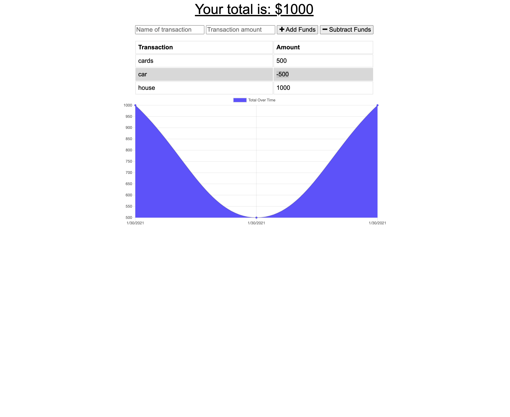

# BudgetTraker

* [Link](#Link)
* [Usage](#usage)
* [Credits](#credits)

## Link
https://boiling-ravine-29399.herokuapp.com/
## Usage
The Budget Traker app allows the users to keep track of their income and expenses when they are online as well as offline.
### instructions 
The user can set an initial income by adding a description of any transaction this being positive or negative, this will be ilustrate in the chart.

## Credits
Open source project.

## Contributing
If you would like to participate on this project, please submit any bugs or feature requests to the contact listed on the questions section of this README.

# Contact
* GitHub :japb1998
* Linkedin :japb1998
* E-mail :japb1998@gmail.com